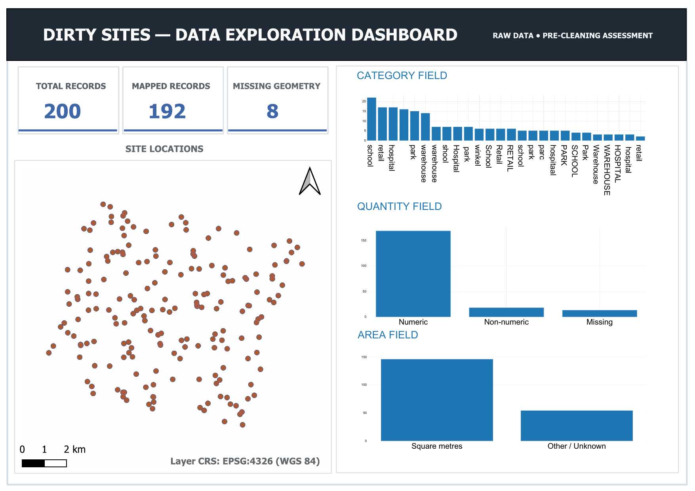

# Evidence: Competency 1

## Purpose

This technical evidence documents the inspection and controlled import of the source dataset [`dirty_sites_nl_v2.csv`](data/dirty_sites_nl_v2.csv "Download!").

The workflow was used to determine the source structure, encoding, available geometry information, coordinate characteristics, attribute types, record count, and data-quality issues before and after importing the data into PostgreSQL/PostGIS.

The source data was imported as a raw dataset without cleaning or attribute type conversion at this stage.

---

## 1. Source encoding

The source file encoding was checked before inspecting the CSV contents.


### Finding

The source file is identified as UTF-8 text.

---

## 2. Initial source inspection

The CSV was opened with GDAL using the CSV driver.


### Finding

GDAL successfully opened the source and identified one layer:

`dirty_sites_nl_v2`

At this stage, the layer had no native geometry.

---

## 3. Baseline layer inspection

The source layer was inspected without specifying coordinate fields.


### Findings

The baseline inspection identified:

- 200 source records.
- No native geometry.
- No CRS defined in the source layer.
- The attribute fields were initially interpreted as strings.
- The longitude and latitude fields were also interpreted as strings in the baseline inspection.

This established the initial state of the source before coordinate interpretation.

---

## 4. Coordinate and geometry inspection

The longitude and latitude fields were explicitly identified as the possible X and Y coordinate fields.


### Findings

When the coordinate fields were used as X and Y:

- GDAL interpreted the dataset as point geometry.
- The layer contained 200 features.
- The coordinate extent was `5.050024, 52.051135` to `5.199666, 52.129648`.
- Longitude and latitude were interpreted as numeric values for this inspection.
- The source CRS remained unknown.

The coordinate values are consistent with geographic longitude/latitude coordinates. The numeric range alone is not sufficient to prove the original datum or CRS.

---

## 5. CRS inspection

The source CRS was checked separately.


### Finding

No CRS was defined in the source CSV at the time of inspection.

The source coordinates were later assigned EPSG:4326 during import. This was a CRS assignment, not a reprojection.

---

## 6. Record-count verification with GDAL SQL

The source record count was also checked using GDAL SQL.


### Finding

The SQL count confirms that the source contains 200 records.

---

## 7. Identification of records with missing coordinates

The source was queried using the coordinate interpretation described above to identify records where longitude is NULL.


### Finding

Eight source records have missing longitude values and therefore cannot provide a complete X/Y coordinate pair for point geometry construction.

This finding is consistent with the later PostGIS result showing eight records without geometry.

---

## 8. Controlled import to PostgreSQL/PostGIS

The source dataset was imported into PostgreSQL/PostGIS using `ogr2ogr`.


### Import controls

The documented import command:

- uses the PostgreSQL driver;
- constructs point geometry from the longitude and latitude fields;
- assigns EPSG:4326 to the resulting geometry;
- explicitly selects the source attributes to transfer;
- stores the result in `raw.sites_nl_dirty`.

The longitude and latitude columns were not included in the selected attributes because they were used to construct the point geometry.

`-a_srs EPSG:4326` assigns a CRS to the imported geometry. It does not transform the coordinates.

This was a controlled raw import rather than a cleaning operation.

### Evidence status

The import command is documented as part of the project workflow. Its resulting database state is independently verified by the PostGIS queries below.

No real database credentials are included in this public evidence.

---

## 9. PostGIS record-count verification

The number of records in the imported table was checked in PostgreSQL.

```sql
SELECT COUNT(*)
FROM raw.sites_nl_dirty;

 count 
-------
   200
(1 row)
```

### Finding

The PostGIS table contains 200 records, matching the source record count.

---

## 10. PostGIS SRID verification

The geometry SRIDs were inspected.

```sql
SELECT DISTINCT ST_SRID(wkb_geometry)
FROM raw.sites_nl_dirty;

st_srid
-------

4326
```

Two distinct results were returned:

- `NULL`
- `4326`

### Finding

The imported dataset contains geometries with SRID 4326 and records with NULL geometry.

---

## 11. Verification of records without geometry

The number of records with NULL geometry was checked directly.

```sql
SELECT COUNT(*)
FROM raw.sites_nl_dirty
WHERE wkb_geometry IS NULL;

count
-----
8
```

### Finding

Eight imported records have no geometry.

This matches the eight source records identified by the GDAL query with missing longitude.

---

## 12. Verification of geometries with SRID 4326

The number of geometries carrying SRID 4326 was checked separately.

```sql
SELECT COUNT(*)
FROM raw.sites_nl_dirty
WHERE ST_SRID(wkb_geometry) = 4326;

count
-----
192
```

### Reconciliation

```text
192 records with SRID 4326
+ 8 records with NULL geometry
= 200 records
```

This matches both the source and PostGIS record counts.

---

## 13. PostGIS attribute-type inspection

The imported attribute types were checked through PostgreSQL metadata.

```sql
SELECT column_name, data_type
FROM information_schema.columns
WHERE table_name = 'sites_nl_dirty';

  column_name   |     data_type     
----------------+-------------------
 ogc_fid        | integer
 id             | character varying
 address        | character varying
 category       | character varying
 quantity       | character varying
 area           | character varying
 price_eur      | character varying
 date_collected | character varying
 notes          | character varying
 wkb_geometry   | USER-DEFINED
(10 rows)
```


### Finding

Several fields that could potentially represent numeric or date values remain stored as `character varying`.

No type conversion was performed during this raw import stage.

---

## 14. Geometry validity verification

Geometry validity was checked in PostGIS only for records that have geometry.

```sql
SELECT
    COUNT(*) AS invalid_geometries
FROM raw.sites_nl_dirty
WHERE wkb_geometry IS NOT NULL
  AND NOT ST_IsValid(wkb_geometry);

invalid_geometries
------------------
0
```

The number of valid geometries was then checked:

```sql
SELECT
    COUNT(*) AS valid_geometries
FROM raw.sites_nl_dirty
WHERE wkb_geometry IS NOT NULL
  AND ST_IsValid(wkb_geometry);

valid_geometries
----------------
192
```

A further query was used to identify invalid geometry reasons:

```sql
SELECT
    id,
    ST_IsValidReason(wkb_geometry) AS validity_reason
FROM raw.sites_nl_dirty
WHERE wkb_geometry IS NOT NULL
  AND NOT ST_IsValid(wkb_geometry);

0 row(s) fetched.
```

### Finding

All 192 imported records that contain geometry pass the PostGIS `ST_IsValid` check.

There are no invalid geometries among the 192 records with geometry.

---

## 15. Failed geometry-validity attempt in GDAL

An earlier GDAL attempt was made to check geometry validity using SQLite SQL:

```bash
ogrinfo \
  dirty_sites_nl_v2.csv \
  -dialect SQLite \
  -sql "SELECT COUNT(*)
        FROM dirty_sites_nl_v2
        WHERE ST_IsValid(geometry) = 0"


ERROR 1: In ExecuteSQL(): sqlite3_prepare_v2(): no such column: geometry
```

### Interpretation

This query was unsuccessful because the CSV layer did not expose a column named `geometry` for that query.

This failed attempt is not used as evidence of geometry validity.

The validity result reported above comes from the successful PostGIS checks.

---

## 16. Inspection findings relevant to later cleaning

The inspection also identified examples of inconsistent attribute values.

Examples from the source records include:

- `hospitaal`
- `warehouse ` — trailing whitespace
- `PARK` — different capitalization
- `parc`
- `retail`

One address also contains surrounding whitespace:

```text
  Dorpsstraat 196
```

These observations identify attribute-quality issues that can be addressed during the data-cleaning stage.

No normalization or cleaning was performed as part of this inspection evidence.

---

## 17. Evidence summary

| Area                             | Verified result                                |
| -------------------------------- | ---------------------------------------------- |
| Source format                    | CSV                                            |
| Encoding                         | UTF-8                                          |
| Source layer                     | `dirty_sites_nl_v2`                            |
| Source records                   | 200                                            |
| Initial geometry                 | None                                           |
| X/Y interpretation               | Point                                          |
| Source CRS                       | Unknown                                        |
| Coordinate extent                | `5.050024, 52.051135` to `5.199666, 52.129648` |
| Records with missing longitude   | 8                                              |
| Imported records                 | 200                                            |
| Records with SRID 4326           | 192                                            |
| Records without geometry         | 8                                              |
| Valid geometries                 | 192                                            |
| Invalid geometries               | 0                                              |
| Selected source attributes       | 8                                              |
| Several imported attribute types | `character varying`                            |

---

## 18. Data exploration dashboard (QGIS)

A QGIS print-layout dashboard was produced from the raw imported dataset to visually consolidate the findings established in Sections 3, 4, 7, 16, and 17.



[Download the full-resolution dashboard (PDF)](additional/dashboard_QGIS.pdf "Download!")

### Findings

The dashboard confirms, using QGIS directly on the raw imported layer:

- 200 total records, 192 mapped, 8 with missing geometry — matching the GDAL and PostGIS counts established above.
- The layer CRS is reported as EPSG:4326 (WGS 84), consistent with the CRS assigned during import.
- The `category` field contains at least 26 visually distinct raw values, consistent with the attribute-quality issues identified in Section 16.
- The `quantity` and `area` fields contain a mix of numeric, non-numeric, and missing values, consistent with these fields still being stored as `character varying` (Section 13).

### Evidence status

This dashboard was produced directly from the raw, pre-cleaning dataset in QGIS. It is a visual cross-check of findings already established through GDAL and PostGIS, not a new or separate verification method.

---

## Evidence boundaries

This evidence demonstrates practical capability in inspecting a spatial CSV, interpreting coordinate fields, identifying missing coordinate data, checking source structure and types, performing a controlled import into PostGIS, and verifying the imported result.

The evidence does not demonstrate that:

- the original source CRS was definitively EPSG:4326;
- the source attributes were cleaned or normalized;
- string attributes were converted to appropriate numeric or date types;
- the eight missing coordinates were repaired;
- the imported data was corrected after inspection.

EPSG:4326 was assigned during the import workflow. The source inspection itself reported the CRS as unknown.

The geometry validity result applies to the 192 records that contain geometry. It does not establish validity for the eight records without geometry.

The failed GDAL geometry-validity query is retained as part of the technical audit but is not treated as successful evidence.

## Technical capability demonstrated

This evidence demonstrates the ability to:

- inspect an unfamiliar spatial CSV before loading it into a spatial database;
- identify its structure, encoding, record count, coordinate fields, and CRS state;
- use GDAL to interpret longitude and latitude as point geometry;
- identify records that cannot produce geometry because coordinate information is missing;
- perform a controlled raw import into PostgreSQL/PostGIS;
- verify record counts, geometry presence, SRIDs, and attribute data types after import;
- perform geometry validity checks using PostGIS;
- reconcile source and database results to verify that the complete 200-record dataset is accounted for.

The evidence supports **demonstrated hands-on capability in data sourcing and inspection**. Data cleaning and correction are outside the scope of this evidence.
